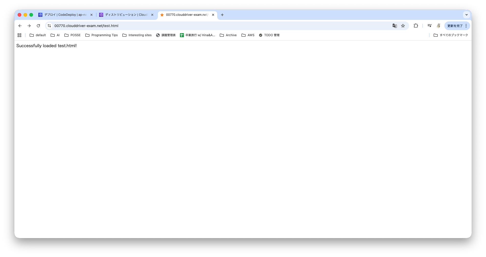

# clouddriver-ec2-architecture-test
ClouddriverをEC2上に構築するcdkを配置しています。

各種コマンドは `mise.toml` に記載しています。

## clouddriver-ec2-architecture-test-app
以下のリポジトリは、簡易的なアプリケーションのソースコードを配置しており、CodeDeployを使用してEC2インスタンスにデプロイするために使用しています。

https://github.com/Sakinom/clouddriver-ec2-architecture-test-app/tree/7bdae44457f39744aa2f449cd906a0c61c3b39a4

なお、挙動の確認は、以下のURLにアクセスし、`Run workflow`ボタンを押下してください。

https://github.com/Sakinom/clouddriver-ec2-architecture-test-app/actions/workflows/deploy.yml

### 成功していた場合
`https://00770.clouddriver-exam.net/test.html` にアクセスした際に、以下のような画面が表示されます。

